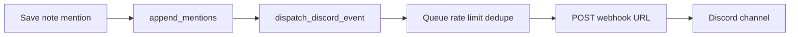

# Plan: Discord Webhook (v1) — consolidated

> Mirror of [plan_discord_webhook_v1.mdc](../rules/plan_discord_webhook_v1.mdc) with iterations: flexible URL, admin-only config, future events roadmap.

Mục tiêu: studio nhận **thông báo pipeline trên Discord** mà **không cần server MONOS**. Mỗi máy POST tới Discord Webhook URL khi sự kiện được bật.

---

## Quyết định đã chốt

| Chủ đề | Quyết định |
|--------|------------|
| **Webhook URL** | **Nhập linh hoạt** — admin paste URL từ Discord; **không hardcode** trong app/build |
| **Lưu config** | `workspace_root/.monostudio/integrations.json` (sync Dropbox) |
| **Ai sửa URL** | **Chỉ admin/dev** đã unlock Access (`is_admin_capable()`) |
| **Artist runtime** | Vẫn **gửi** webhook khi save @mention; chỉ **cấu hình** bị khóa |
| **v1 scope** | Workspace-level, event `mention` only |
| **Phạm vi project** | Project-level webhook override → v2 |

---

## 1. URL webhook — không hardcode

- Admin tạo **Incoming Webhook** trên kênh Discord → copy URL  
  `https://discord.com/api/webhooks/{id}/{token}`
- Paste trong **Settings → Project → Integrations**
- Đổi kênh = đổi URL hoặc tạo webhook mới trên Discord
- App ship **không chứa** URL studio nào

Không cần Discord Bot / server ID riêng — URL đã gắn kênh đích.

---

## 2. Admin-only cấu hình

Dùng [`monostudio/core/access_control.py`](../../monostudio/core/access_control.py) → `is_admin_capable()`.

Pattern giống `_refresh_pipeline_access_lock` trong [`settings_dialog.py`](../../monostudio/ui_qt/settings_dialog.py):

| Session | Integrations UI |
|---------|-----------------|
| Admin/Dev unlocked | Sửa enable, URL, events, Save, Send test |
| Artist (locked) | Read-only: trạng thái + URL masked |
| No access keys (dev) | Mọi người sửa được |

Banner khi locked:

> Discord integration is locked. Unlock in General → Access with an administrator or developer key.

**Core guard:** `write_integrations()` từ chối ghi nếu `not is_admin_capable()`.

---

## 3. Config schema

**File:** `workspace_root/.monostudio/integrations.json`

```json
{
  "schema": 1,
  "updated_at": "2026-06-07T12:00:00Z",
  "discord": {
    "enabled": true,
    "webhooks": [
      {
        "id": "wh_a1b2c3",
        "label": "#pipeline-general",
        "url": "https://discord.com/api/webhooks/...",
        "events": {
          "mention": true,
          "inbox_distributed": false,
          "schedule_due": false
        }
      }
    ],
    "defaults": {
      "username": "MONOS",
      "avatar_url": ""
    }
  }
}
```

---

## 4. Event catalog

### v1 — implement

| Event | Trigger | Hook |
|-------|---------|------|
| `mention` | Save note có @mention | `item_notes_dialog._dispatch_mentions_for_new_entries` → `append_mentions` |

### v1.1 — Phase 2 (implement)

| Event | Trigger | Hook |
|-------|---------|------|
| `inbox_distributed` | Inbox distribute xong | `MainWindow._on_inbox_distribute_finished` |
| `schedule_due` | Overdue + due today, tối đa 1 lần/ngày/project | `discord_schedule_due.maybe_dispatch_schedule_due` · timer 24h + mở project |

### v1.2 — Polish

| Event | Mô tả |
|-------|--------|
| `discord_user_ping` | Roster field `discord_user_id` → `<@id>` trong mention |
| Multi-webhook | Nhiều URL, mỗi URL chọn events (vd `#mentions`, `#inbox`) |
| Per-machine opt-out | `QSettings` `discord/disabled_locally` |
| Outbox retry | `discord_outbox.json` khi offline |

### v2 — Collaboration

| Event | Trigger | Hook gợi ý |
|-------|---------|------------|
| `note_done` | Tick done trên note | `item_notes_dialog._on_done_toggled` |
| `inbox_received` | File mới vào Inbox | Sau `add_to_inbox` / inbox drop |
| `trash_moved` | Asset/shot → trash | `move_asset_or_shot_to_trash` |
| `team_request` | Request account mới | `account_requests.json` flow |
| Project webhook | Kênh riêng từng project | `project_root/.monostudio/integrations.json` |

### v3 — Pipeline nâng cao

| Event | Ghi chú |
|-------|---------|
| `publish_new` | Cần hook thống nhất publish scan |
| `project_created` | `_new_project` flow |
| `schedule_milestone` | Chỉ milestone lớn, không mọi save |
| `daily_digest` | 1 message/ngày gom mentions + inbox + schedule |

### Không đẩy Discord (quá noisy)

- `schedule_saved` mỗi lần edit
- File watcher / rescan
- `notification_service.info/success` thường ngày
- Mở DCC, tạo work file

---

## 5. Kiến trúc



**Nguyên tắc:** fire at write time · background thread · fail silent · opt-in · rate limit ~25/min/webhook · core không phụ thuộc Qt.

---

## 6. HTTP (Discord)

```
POST {webhook_url}?wait=false
Content-Type: application/json
```

Embed @mention + `allowed_mentions: { "parse": [] }`. Pattern POST: [`update_checker.py`](../../monostudio/core/update_checker.py).

---

## 7. UI — Settings → Project → Integrations

```
[ Banner if locked ]
[ Card: Discord ]
  Enable                    [ toggle ]     admin only
  Webhook URL               [ masked ]     admin only + Replace
  Channel label             [ text ]       admin only
  ☑ @mentions               admin only
  ☑ Inbox distributed       admin only
  ☑ Schedule due (daily)    admin only
  [ Send test ] [ Save ]    admin only
```

Kết nối `access_session_changed` → `_refresh_integrations_access_lock()`.

---

## 8. Implementation phases

### Phase 1 (v1.0)

1. `integrations_config.py` — read/write + admin guard
2. `discord_webhook.py` — embed, POST, queue
3. Wire `mention` in `item_notes_dialog.py`
4. Settings Integrations tab + admin lock
5. Manual test Discord channel

### Phase 2 (v1.1) — done

6. `inbox_distributed`, `schedule_due`
7. Project-level override (optional) — deferred

### Phase 3 (v1.2) — in progress

8. `discord_user_id` — done (Team → Discord ID + `<@ping>` in mention/assign)
9. `note_done` — done (save note when marked done)
10. Per-machine opt-out — done (`QSettings` `discord/disabled_locally`)
11. Multi-webhook UI, outbox retry, project-level override — deferred
12. v2 events (`trash_moved`, `team_request`) — deferred

---

## 9. Files

| Area | File |
|------|------|
| Config | Mới: `monostudio/core/integrations_config.py` |
| Send | Mới: `monostudio/core/discord_webhook.py` |
| Mention | `monostudio/ui_qt/item_notes_dialog.py` |
| Settings | `monostudio/ui_qt/settings_dialog.py` |

**Không sửa** `notification_service` — Discord song song in-app bell/toast.

---

## 10. Test plan

- [ ] @mention → 1 Discord embed
- [ ] Disabled → no POST
- [ ] Invalid URL → test fails; save note OK
- [ ] Rate limit / dedupe under burst
- [ ] Offline → save OK, log warning
- [ ] Dropbox sync integrations.json
- [ ] URL masked; artist cannot edit
- [ ] Admin unlock → edit + save works

---

## 11. Out of scope

Discord Bot, server relay, two-way sync, file attachments, Slack/Teams (same pattern later).
